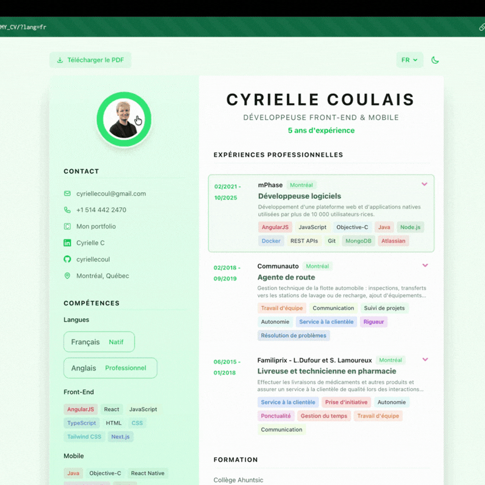

# Interactive Resume

Built with React, TypeScript, Tailwind CSS, and Framer Motion.

**[▶ Live Demo](https://cyriellecoul.github.io/MY_CV/)**

<p align="center">
  
</p>

## Features

- **One config file** — Edit a single TypeScript file with your info
- **Multi-language** — Built-in i18n support (add as many languages as you need)
- **Dark / Light mode** — Auto-detects time of day, with manual toggle
- **Responsive** — Mobile-first, works on all screen sizes
- **Expandable experiences** — Click to expand details (inline on desktop, modal on mobile)
- **PDF download** — Downloadable resume, one per language
- **SEO & ATS ready** — Full CV content visible to crawlers at build time (JSON-LD, semantic HTML fallback)
- **3D photo flip** — Click the photo for a fun easter egg

## Tech Stack

- [Vite](https://vite.dev/) — Fast build tool
- [React 19](https://react.dev/) — UI framework
- [TypeScript](https://www.typescriptlang.org/) — Type safety
- [Tailwind CSS v4](https://tailwindcss.com/) — Utility-first CSS
- [Framer Motion](https://www.framer.com/motion/) — Animations

## Quick Start 

### 1. Clone the repo

```bash
git clone
cd interactive-resume
npm install
```

### 2. Preview locally

```bash
npm run dev
```

Open http://localhost:5173 in your browser.

Then enjoy !

## License

MIT - Author Clement Bouly
Improvements Cyrielle Coulais
